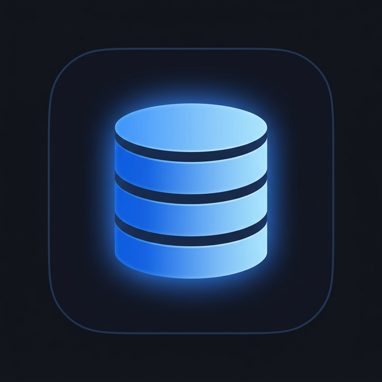

<p align="center">
  
</p>

<h1 align="center">SoftDB</h1>

<p align="center">
  <strong>Modern Database Management Tool</strong><br/>
  Connect, explore, and manage your databases with a beautiful cross-platform desktop app.
</p>

<p align="center">
  <a href="https://github.com/zane-tv/soft-db/releases"></a>
  <a href="LICENSE"></a>
  <a href="https://github.com/zane-tv/soft-db/releases"></a>
</p>

---

## ✨ Features

- 🗄️ **Multi-Database Support** — PostgreSQL, MySQL, MariaDB, SQLite, MongoDB, Redshift
- 📝 **Monaco SQL Editor** — Syntax highlighting, autocomplete, multi-tab queries
- 🔍 **Visual Table Explorer** — Browse schemas, tables, and columns with inline data preview
- 🏗️ **Structure Designer** — Create and modify tables visually with a drag-and-drop column editor
- 🔗 **Multi-Connection Tabs** — Work with multiple databases side-by-side
- ⚙️ **Connection Manager** — Save, organize, and quick-connect to your databases
- 🌙 **Dark Mode** — Beautiful dark UI designed for long coding sessions

## 🗃️ Supported Databases

| Database | Status |
|----------|--------|
| PostgreSQL | ✅ Full support |
| MySQL | ✅ Full support |
| MariaDB | ✅ Full support |
| SQLite | ✅ Full support |
| MongoDB | 🟡 Basic support |
| Redshift | 🟡 Basic support |

## 🚀 Quick Start

### Download

Download the latest release for your platform from the [Releases page](https://github.com/zane-tv/soft-db/releases).

### Build from Source

**Prerequisites:**
- [Go](https://golang.org/dl/) 1.22+
- [Bun](https://bun.sh/) (or Node.js 18+)
- [Wails CLI v3](https://v3.wails.io/getting-started/installation/)

```bash
# Clone the repository
git clone https://github.com/zane-tv/soft-db.git
cd soft-db

# Development mode (hot-reload)
wails3 dev

# Production build
wails3 build
```

## 🛠️ Tech Stack

| Layer | Technology |
|-------|-----------|
| **Desktop Runtime** | [Wails v3](https://v3.wails.io/) (Go + WebView) |
| **Backend** | Go 1.22+ |
| **Frontend** | React + TypeScript + Vite |
| **SQL Editor** | Monaco Editor |
| **Routing** | TanStack Router |
| **State** | TanStack Query |
| **Styling** | Tailwind CSS |

## 📁 Project Structure

```
soft-db/
├── main.go              # App entry point
├── services/            # Go backend services (connection, query, schema)
├── internal/            # Database drivers & local store
├── frontend/
│   ├── src/
│   │   ├── pages/       # Main views (ConnectionHub, TableExplorer)
│   │   ├── components/  # Reusable UI components
│   │   ├── hooks/       # React hooks for API calls
│   │   └── routes/      # TanStack Router config
│   └── ...
└── build/               # Build config, icons, platform assets
```

## ⭐ Star History

[](https://star-history.com/#zane-tv/soft-db&Date)

## 📄 License

[MIT](LICENSE) — Made with ❤️ by [Zane](https://github.com/zane-tv)
