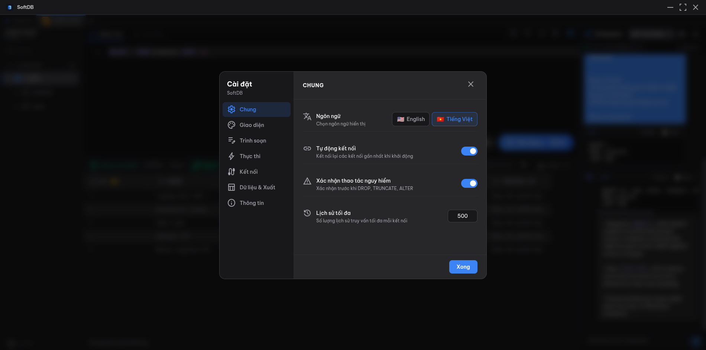

import { Aside } from '@astrojs/starlight/components';

The Settings panel is your control center for every aspect of SoftDB's behavior. Open it by clicking the **gear icon** in the bottom-left corner of the Connection Hub, or from any active workspace tab.

<Aside>
Settings are stored locally in SoftDB's SQLite database and persist across app restarts. Nothing is synced to the cloud.
</Aside>

## Navigating Settings

The modal has a sidebar on the left listing each category. Click any category to jump to its options. When you're done, click **Done** or press `Escape` to close.

## Settings Categories

| Category | What it controls |
|----------|-----------------|
| **General** | Language, auto-connect on startup, dangerous-action confirmations, query history limit |
| **Appearance** | Theme (dark/light variants), font size, row density in the data grid |
| **Editor** | Tab size, word wrap, line numbers, auto-uppercase SQL keywords |
| **Execution** | Query timeout, default row limit, auto-limit, mutation confirmations, risk warnings |
| **Connection** | Connection timeout for new database connections |
| **Data** | NULL display style, date format, export format, CSV delimiter |
| **About** | App version, keyboard shortcuts reference, supported databases |

---

## General

The General section covers app-wide behavior that doesn't fit neatly into a single feature.

**Language** switches the UI between English and Vietnamese. The change takes effect immediately without a restart.

**Auto-connect** controls whether SoftDB automatically reconnects to your last-used connection when the app opens. It's off by default so you always start from the Connection Hub.

**Confirm dangerous operations** shows a confirmation dialog before running `DROP`, `TRUNCATE`, or other destructive statements. Enabled by default.

**Max history** sets how many query history entries SoftDB keeps per connection. The default is 500. Older entries are trimmed automatically once the limit is reached.

---

## Appearance

Controls the visual presentation of the app. See [Appearance](/customization/appearance) for a full breakdown.

- **Theme** — choose from multiple dark and light themes. The active theme is highlighted with a checkmark.
- **Font size** — adjusts the base font size for the editor and data grid (10–24 px, default 13 px).
- **Row density** — sets the row height in the data grid: Compact, Normal, or Comfortable.

---

## Editor

These settings control the Monaco SQL editor embedded in every workspace tab.

**Tab size** sets how many spaces a Tab keypress inserts. Options are 2 or 4 spaces (default: 2).

**Word wrap** toggles whether long lines wrap inside the editor viewport or scroll horizontally. Off by default.

**Line numbers** shows or hides the gutter with line numbers. On by default.

**Auto-uppercase** automatically converts SQL keywords to uppercase as you type — `select` becomes `SELECT`, `from` becomes `FROM`, and so on. Off by default.

---

## Execution

These settings govern how queries run and what safety checks fire before execution.

**Query timeout** is the maximum number of seconds SoftDB waits for a query to complete before cancelling it. Default is 30 seconds. Raise it for long-running analytical queries.

**Default limit** is the row count used when you run a `SELECT` without an explicit `LIMIT`. Default is 100.

**Auto-limit** automatically appends `LIMIT <default limit>` to any `SELECT` statement that doesn't already have one. Off by default — enable it if you frequently query large tables.

**Confirm mutations** shows a confirmation dialog before executing `INSERT`, `UPDATE`, or `DELETE` statements. Off by default.

**Warn on query risks** shows a warning banner when SoftDB detects potentially dangerous patterns in your query (e.g., a `DELETE` without a `WHERE` clause). On by default.

**Warn on limited query analysis** shows a notice when SoftDB's static analysis can't fully inspect a query — for example, complex CTEs or dynamic SQL. On by default.

---

## Connection

**Connection timeout** is how long SoftDB waits when establishing a new database connection before giving up. Default is 15 seconds. Increase it for slow networks or databases behind SSH tunnels.

---

## Data

These settings affect how data is displayed and exported.

**NULL display** controls how `NULL` values appear in the data grid:
- **Badge** (default) — a small grey `NULL` badge
- **Italic** — the text *null* in italic
- **Dash** — an em dash (—)

**Date format** controls how date and timestamp columns are rendered:
- **ISO 8601** (default) — `2024-03-15T10:30:00Z`
- **US** — `03/15/2024`
- **EU** — `15/03/2024`
- **Relative** — `2 hours ago`

**Export format** sets the default file format when you export query results. Options are CSV (default), JSON, and TSV.

**CSV delimiter** is the character used to separate fields in CSV exports. Default is a comma (`,`). Change it to a semicolon for European locales or a tab for TSV-style output.

---

## About

The About section shows the current app version and a quick-reference table of keyboard shortcuts. It also lists every supported database engine with its status indicator.

No settings are configurable here — it's purely informational.
