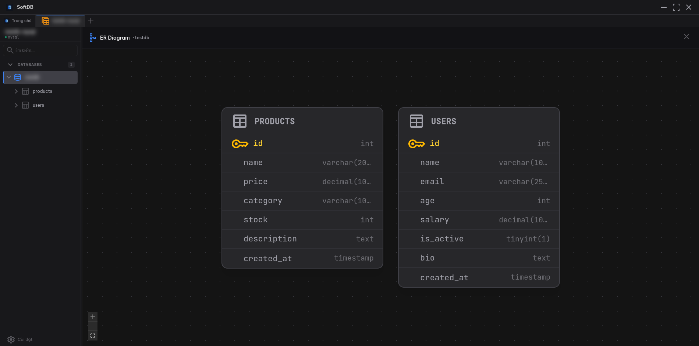

import { Aside } from '@astrojs/starlight/components';

The ER Diagram gives you a visual map of your database schema. It reads foreign key metadata from your database and renders an interactive graph showing how tables connect to each other.

## Opening the Diagram

Click the **schema icon** (the branching graph icon) in the toolbar while viewing a connection. The diagram loads automatically and lays out all tables that have foreign key relationships.

## How It Works

SoftDB fetches column and foreign key metadata for every table in the current database. Tables are rendered as nodes with their columns listed inside. Foreign key relationships become edges connecting the relevant columns between tables.

**Auto-layout** positions the nodes using the ELK graph layout engine with a layered algorithm. Tables flow left to right, with referenced tables (parents) appearing before the tables that reference them (children). This makes it easy to follow the direction of relationships at a glance.

Each table node shows:
- The table name in the header
- All columns with their data types
- Primary key columns highlighted in amber with a key icon
- Foreign key columns highlighted when a relationship is selected

## Navigation

**Zoom** — use the scroll wheel or the zoom controls in the bottom-left corner to zoom in and out.

**Pan** — click and drag on the background to move around the diagram.

**Select a table** — click any table node to highlight it. All foreign key edges connected to that table are emphasized, and the related columns in connected tables are highlighted too. This makes it easy to trace relationships without losing track of which columns are involved.

**Fit to screen** — click the fit button in the controls panel to zoom and pan so all tables are visible at once.

## Limitations

<Aside type="caution">
The ER Diagram only shows tables that have at least one foreign key relationship. Tables with no FK constraints won't appear, even if they exist in the database.
</Aside>

**MongoDB is not supported.** MongoDB is a document database without a fixed relational schema, so there are no foreign keys to visualize. The ER Diagram is only available for SQL connections (PostgreSQL, MySQL, MariaDB, SQLite, Redshift).

The diagram is read-only. You can't create or modify relationships from this view — use the Structure Designer for schema changes.
