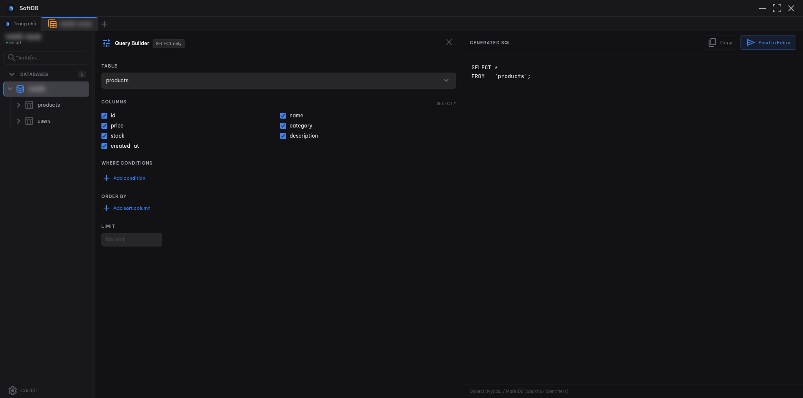

import { Aside } from '@astrojs/starlight/components';
import queryBuilderImg from '../../../assets/screenshots/query-builder.png';

The Query Builder gives you a point-and-click interface for constructing `SELECT` queries. No SQL knowledge required — pick a table, choose your columns, add filters, and SoftDB writes the query for you. The generated SQL updates live as you make changes, so you always see exactly what will run.

## Opening the Query Builder

Click the **tune** icon (⚙) in the SQL Editor toolbar to open the Query Builder panel. It slides in alongside the editor, splitting the view into a configuration pane on the left and a live SQL preview on the right.

The panel is labeled **SELECT only** — it builds read-only queries. For mutations, write SQL directly in the editor.

## Building a Query

### 1. Select a table

The first dropdown lists every table in the current connection. Pick one and the builder loads its columns automatically.

### 2. Choose columns

All columns are checked by default, which produces `SELECT *`. Uncheck any column to exclude it from the result. The header shows how many columns are selected and a **reset to \*** link to restore the default.

The column list scrolls if your table has many fields, so you can work with wide schemas without losing context.

### 3. Add WHERE conditions

Click **Add condition** to filter rows. Each condition row has three parts:

- **Column** — pick from the table's columns
- **Operator** — choose from `=`, `!=`, `>`, `<`, `>=`, `<=`, `LIKE`, `IN`, `IS NULL`, `IS NOT NULL`
- **Value** — type the comparison value (hidden automatically for `IS NULL` / `IS NOT NULL`)

When you have two or more conditions, a toggle button appears in the section header. Click it to switch between **AND** (all conditions must match) and **OR** (any condition matches). The label on each row updates to show the active logical operator.

**Operator tips:**
- `LIKE` — use `%` as a wildcard, e.g. `%smith%`
- `IN` — enter a comma-separated list, e.g. `1, 2, 3`
- Numeric values are passed unquoted; text values are automatically single-quoted and escaped

### 4. Sort results (ORDER BY)

Click **Add sort column** to add an `ORDER BY` clause. Each sort row lets you pick a column and choose `ASC ↑` or `DESC ↓`. Add multiple rows to sort by several columns in priority order.

### 5. Limit rows

Enter a number in the **LIMIT** field to cap how many rows are returned. Leave it blank for no limit.

<Aside type="tip">
  Always set a LIMIT when exploring large tables. Without one, a query on a multi-million-row table can return more data than the grid can handle comfortably.
</Aside>

## Using the Generated SQL

The right pane shows the formatted SQL as you build. Two buttons sit in the top-right corner:

- **Copy** — copies the SQL to your clipboard
- **Send to Editor** — inserts the SQL into the Monaco editor, where you can run it, tweak it, or save it as a snippet

The footer shows the active SQL dialect: MySQL and MariaDB use backtick identifiers (`` `column` ``), while PostgreSQL, SQLite, and Redshift use double-quote identifiers (`"column"`).

<Aside type="note">
  The Query Builder only generates `SELECT` statements. To run the query, click **Send to Editor** and press **Ctrl+E** (or **Cmd+E** on macOS) to execute.
</Aside>
