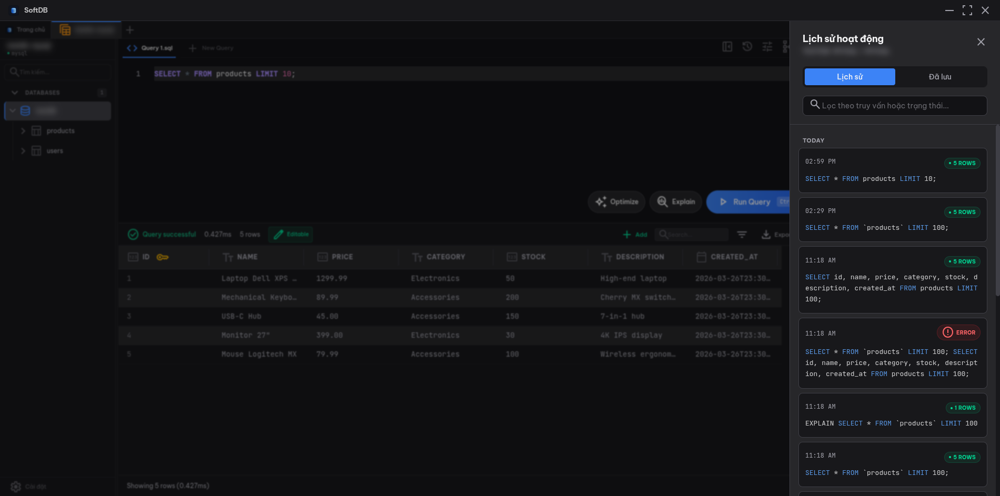

import { Aside } from '@astrojs/starlight/components';

SoftDB automatically records every query you run and lets you save the ones worth keeping as named snippets. Both live in the **History & Snippets** drawer, which slides in from the right side of the SQL Editor.

## Query History

### How history works

Every time you execute a query — whether it succeeds, fails, or modifies data — SoftDB saves it to a per-connection history log. History is stored locally and persists across sessions. The maximum number of entries is controlled by the **Max History** setting in Preferences.

Each entry shows:
- The query text (truncated for long queries, expandable on hover)
- Execution status: `success`, `error`, or `mutation`
- Execution time and rows affected

Entries are grouped by date: **Today**, **Yesterday**, and older dates, so you can quickly find something you ran earlier this week.

### Searching history

The search box at the top of the drawer filters entries in real time. It matches against both the query text and the status label, so you can type `error` to find failed queries or `DROP` to find destructive operations.

### Re-executing a query

Click the **Use** button on any history entry to load that query back into the SQL Editor. The drawer closes automatically and the editor is ready to run.

You can also click **Copy** to copy the query to your clipboard without loading it into the editor.

### Saving from history

Each history entry has a **Save** button (bookmark icon). Clicking it creates a quick snippet with an auto-generated title based on the query's leading operation and table name. If the query is already saved, the button changes to **Unsave** and clicking it deletes the snippet.

---

## Snippets

Snippets are named, reusable queries you save intentionally. They're more than bookmarks — you can organize them into folders, tag them, mark favorites, and scope them to a single connection or share them globally across all connections.

### Creating a snippet

There are three ways to create a snippet:

1. **From history** — click **Save** on any history entry for a one-click save with an auto-generated title
2. **From the editor** — press **Ctrl+S** (or **Cmd+S** on macOS) while in the SQL Editor to open the snippet editor pre-filled with the current query
3. **Manually** — switch to the **Saved** tab in the drawer and click **+ New Snippet** at the bottom

The snippet editor has fields for:
- **Title** — a short, descriptive name
- **Query** — the SQL text (editable)
- **Folder** — an optional path like `reports/monthly` to organize snippets into groups
- **Tags** — comma-separated labels for filtering, e.g. `analytics, slow-queries`
- **Scope** — connection-scoped (only visible for this connection) or global (visible from any connection)

### Connection-scoped vs. global snippets

**Connection snippets** are tied to the connection they were created in. They're ideal for queries that reference database-specific tables or schemas.

**Global snippets** are available from every connection. Use them for utility queries that work across databases, like `SELECT version()` or common diagnostic patterns.

The scope filter dropdown in the Saved tab lets you show **All**, **Connection**, or **Global** snippets.

### Favorites and tags

Star any snippet to mark it as a favorite. The star button in the drawer header toggles a **Favorites only** filter so you can quickly surface your most-used queries.

Tags appear on each snippet card and are searchable. The search box in the drawer matches against title, query text, folder path, scope, and tags simultaneously.

### Managing snippets

Each snippet card has three action buttons:

- **Use** — loads the query into the SQL Editor
- **Copy** — copies the query to clipboard
- **Edit** (pencil icon) — opens the snippet editor to rename, retag, or change scope
- **Delete** (trash icon) — prompts for confirmation before deleting

<Aside type="caution">
  Deleting a snippet is permanent. There's no undo. If you're unsure, edit the snippet instead of deleting it.
</Aside>

### Organizing with folders

Folder paths use forward slashes as separators. For example, setting the folder to `reports/monthly` nests the snippet under a `monthly` subfolder inside `reports`. You can filter the snippet list by typing a folder path into the **Folder path** input in the Saved tab header.

Folders aren't created explicitly — they exist as long as at least one snippet references them.
