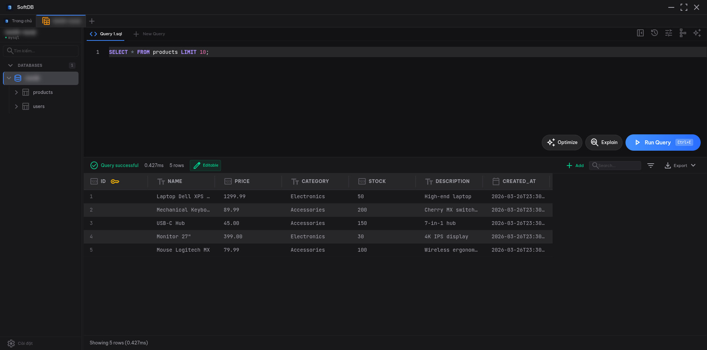

import { Aside, Steps, Tabs, TabItem } from '@astrojs/starlight/components';

The SQL Editor is the heart of SoftDB. Built on [Monaco Editor](https://microsoft.github.io/monaco-editor/) — the same engine that powers VS Code — it gives you a full-featured coding environment tuned specifically for database work.



## Writing Queries

Type SQL directly into the editor. The editor supports standard SQL syntax with full highlighting for keywords, strings, numbers, comments, and operators.

**Multiple statements** are supported. Separate them with semicolons and SoftDB will execute them in sequence:

```sql
CREATE TABLE users (id SERIAL PRIMARY KEY, name TEXT);
INSERT INTO users (name) VALUES ('Alice'), ('Bob');
SELECT * FROM users;
```

**Selection execution** lets you run just part of your query. Highlight any text before pressing the run shortcut and only the selected portion executes. This is handy when you have a long file with multiple queries and want to test one at a time.

## Autocomplete

The editor provides schema-aware completions as you type. No configuration needed — it reads your live schema automatically.

**What gets completed:**

- **Tables** — all tables in the current connection appear as suggestions
- **Views** — listed alongside tables with a distinct icon
- **Functions** — database functions with auto-inserted parentheses
- **SQL keywords** — SELECT, FROM, WHERE, JOIN, and the rest
- **Snippets** — common query patterns like `SELECT ... FROM ... WHERE`

**Column completion** works lazily. When you type `tablename.`, the editor fetches that table's columns on demand and shows them with their types and primary key markers. Columns are sorted so primary keys appear first.

<Aside type="tip">
Column suggestions load the first time you type `tablename.` for each table. After that they're cached for the session, so subsequent completions are instant.
</Aside>

## Query Execution

Run your query with **Ctrl+E** (or Cmd+E on Mac). Results appear in the data grid below the editor.

**Explain** runs `EXPLAIN (ANALYZE, FORMAT JSON)` on your query and shows the execution plan. This is available for PostgreSQL and Redshift connections. Use it to understand index usage, join strategies, and where time is being spent.

**Optimize with AI** sends your current query to the AI Assistant with a prompt asking for optimization suggestions. The AI panel opens automatically with the query pre-loaded.

**Cancel** stops a running query. Useful when you accidentally run a slow query against a large table.

<Aside type="tip">
If you have multiple statements in the editor and want to explain just one, select it first before pressing Ctrl+Shift+E.
</Aside>

## Snippets

Snippets let you save queries you run often. They're stored locally and available across sessions.

**Saving a snippet:** Press Ctrl+S (Cmd+S on Mac) while in the editor. Give it a name and optionally assign it to a folder.

**Scope:** Snippets can be **global** (available in every connection) or **connection-scoped** (only visible when connected to a specific database). Connection-scoped snippets are useful for queries that reference tables specific to one project.

**Folders:** Organize snippets into folders using a path like `reports/monthly` or `admin/cleanup`. The snippet browser shows them in a tree.

**Built-in snippet templates** appear in autocomplete alongside your saved ones. Start typing `SELECT`, `INSERT INTO`, `JOIN`, or `CREATE TABLE` to see the templates.

## SQL Formatting

The editor can automatically uppercase SQL keywords as you type. When you finish a word like `select` and press space, it becomes `SELECT`. This keeps your queries consistent without any manual effort.

You can toggle this behavior in **Settings > Editor > Auto-uppercase keywords**.

## Themes

The editor respects your app theme. Switch between Dark, Light, Nord, and Dracula in **Settings > Appearance** and the editor updates immediately — no restart needed.

## Keyboard Shortcuts

| Action | Windows / Linux | macOS |
|--------|----------------|-------|
| Execute Query | Ctrl+E | Cmd+E |
| Explain Query | Ctrl+Shift+E | Cmd+Shift+E |
| Optimize with AI | Ctrl+Shift+O | Cmd+Shift+O |
| Save Snippet | Ctrl+S | Cmd+S |
| Trigger Autocomplete | Ctrl+Space | Ctrl+Space |

<Aside type="tip">
Autocomplete triggers automatically as you type. If the suggestion list doesn't appear, press Ctrl+Space to open it manually.
</Aside>

## MongoDB and Redis

When connected to MongoDB, the editor switches to JSON mode. Write queries as JSON objects:

```json
{ "collection": "users", "action": "find", "filter": { "active": true }, "limit": 100 }
```

Autocomplete provides MongoDB-specific snippets for `find`, `count`, `insert`, `delete`, and common filter operators like `$gt`, `$in`, and `$regex`.

Redis connections use plain text mode. Type Redis commands directly:

```
HGETALL session:abc123
```
