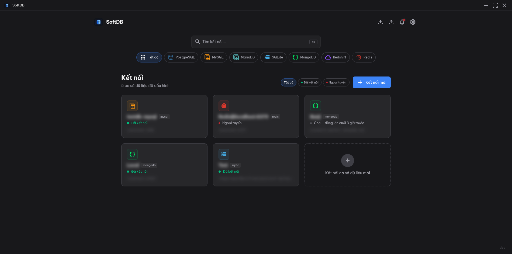
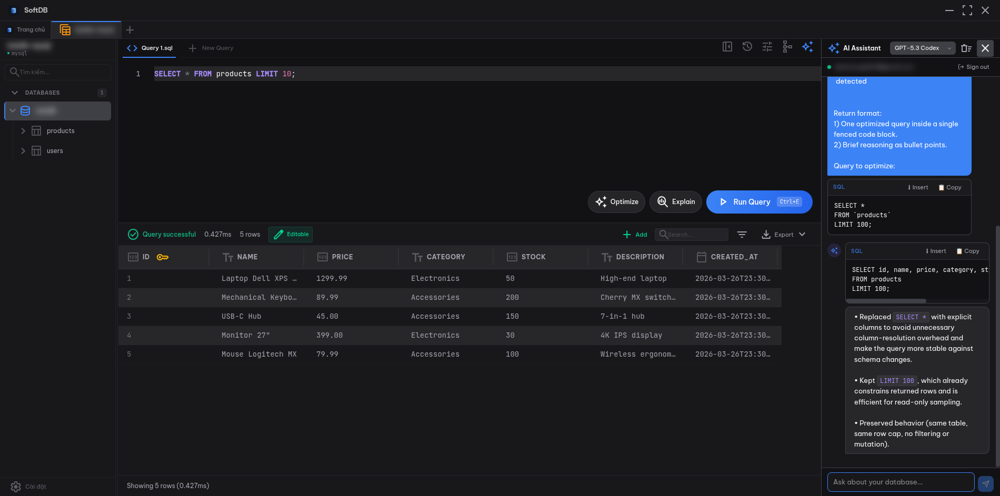

import { Steps, Aside, Card, CardGrid } from '@astrojs/starlight/components';

This guide walks you through launching SoftDB, creating a connection, and running your first query. The whole thing takes about 5 minutes.

## Before You Start

Make sure SoftDB is installed. If not, see the [Installation](/getting-started/installation) guide.

You'll also need a database to connect to. Any of these work:

- A local PostgreSQL or MySQL server
- A SQLite file on your machine
- A remote database (with credentials)
- A MongoDB instance

## Connect to Your First Database

<Steps>
  1. **Launch SoftDB.**

     The app opens to the **Connection Hub** — your home screen for managing saved connections.

     

  2. **Click "New Connection".**

     A connection form slides open. Fill in the details for your database:

     **For MySQL or MariaDB:**
     - Host: `localhost`
     - Port: `3306`
     - Username: your MySQL username
     - Password: your MySQL password
     - Database: the database name (optional — you can browse all databases after connecting)

     **For PostgreSQL:**
     - Host: `localhost`
     - Port: `5432`
     - Username: `postgres` (or your username)
     - Password: your password
     - Database: `postgres` (or leave blank to browse all)

     **For SQLite:**
     - Click **Browse** and select your `.db` or `.sqlite` file
     - No username or password needed

     **For MongoDB:**
     - Host: `localhost`
     - Port: `27017`
     - Leave username/password blank for local instances without auth

     **For Redis:**
     - Host: `localhost`
     - Port: `6379`
     - Password: only if your Redis instance requires one

  3. **Test the connection.**

     Click **Test Connection** before saving. SoftDB will attempt to connect and report back. If it fails, double-check your host, port, and credentials.

  4. **Save and connect.**

     Click **Save**. SoftDB connects immediately and opens the workspace for that database.

     <Aside type="tip">
       Give your connection a descriptive name like "Local Postgres" or "Production MySQL (read-only)". You'll thank yourself later when you have a dozen connections saved.
     </Aside>
</Steps>

## Explore Your Database

Once connected, the left sidebar shows your database structure.


For databases that support multi-DB browsing (PostgreSQL, MySQL, MariaDB, MongoDB, Redshift, Redis), you'll see a 3-level tree:

```
Connection
└── database_name
    ├── table_one
    ├── table_two
    └── table_three
```

Click any table name to open it in the data grid. You'll see the rows, column types, and can scroll through the data. The grid is virtualized, so it handles large tables without freezing.

## Run Your First Query

<Steps>
  1. **Open the SQL Editor tab.**

     Click the **SQL Editor** tab in the main workspace area. A Monaco editor opens — the same editor that powers VS Code.

  2. **Write a query.**

     Type a query in the editor:

     ```sql
     SELECT * FROM users LIMIT 10;
     ```

     As you type, the editor autocompletes table and column names from your live schema.

  3. **Execute it.**

     Press `Ctrl+E` on Windows/Linux or `Cmd+E` on macOS. The results appear in the panel below.

     

  4. **Try a few more queries.**

     ```sql
     -- Count rows in a table
     SELECT COUNT(*) FROM orders;

     -- Find recent records
     SELECT * FROM events
     WHERE created_at > NOW() - INTERVAL '7 days'
     ORDER BY created_at DESC;

     -- Join two tables
     SELECT u.name, COUNT(o.id) AS order_count
     FROM users u
     LEFT JOIN orders o ON o.user_id = u.id
     GROUP BY u.id, u.name
     ORDER BY order_count DESC;
     ```
</Steps>

<Aside type="tip">
  Use `Ctrl+Shift+E` (or `Cmd+Shift+E`) to explain the query execution plan. This runs `EXPLAIN ANALYZE` and shows you how the database is executing your query.
</Aside>

## Try the AI Assistant

SoftDB includes a built-in AI chat panel that knows your database schema.

<Steps>
  1. **Open the AI panel.**

     Click the AI icon in the toolbar (or press the keyboard shortcut). The chat panel opens on the right side.

     

  2. **Ask a question about your data.**

     The AI automatically receives your schema — tables, columns, and types — as context. Try asking:

     > "Show me all tables with their row counts"

     > "Write a query to find users who haven't logged in for 30 days"

     > "What indexes does the orders table have?"

  3. **Copy the generated SQL.**

     The AI responds with SQL you can copy directly into the editor. Click the copy button on any code block in the chat.
</Steps>

<Aside type="note">
  The AI assistant requires an OpenAI API key. Go to **Settings → AI** to add your key. The key is stored locally, encrypted with AES-256-GCM, and never sent anywhere except directly to OpenAI.
</Aside>

## Edit Data Inline

You don't need to write UPDATE statements for simple edits. Double-click any cell in the data grid to edit it inline. Changes are staged until you click **Save Changes**, which runs a parameterized UPDATE behind the scenes.

## What's Next

<CardGrid>
  <Card title="SQL Editor" icon="pencil" href="/features/sql-editor">
    Multi-tab queries, keyboard shortcuts, and execution plan analysis.
  </Card>
  <Card title="Data Grid" icon="list-format" href="/features/data-grid">
    Inline editing, filtering, sorting, and pagination.
  </Card>
  <Card title="AI Assistant" icon="star" href="/features/ai-assistant">
    Configure your OpenAI API key and choose your model.
  </Card>
  <Card title="Connection Management" icon="approve-check" href="/databases/overview">
    SSH tunnels, SSL, and connection pooling options.
  </Card>
</CardGrid>
