# MongoDB Schema Validation Editor — Design Document

## Problem
`StructureDesignerModal` shows SQL-style schema editor (types: `uuid/timestamptz`, constraints: `PK/NN/UN`, DDL: `ALTER TABLE`) for MongoDB collections. MongoDB is schema-less and uses different concepts.

## Solution
When `dbType === "mongodb"`, show a **MongoDB-native schema editor** using [JSON Schema Validation](https://www.mongodb.com/docs/manual/core/schema-validation/).

---

## Architecture

```mermaid
graph LR
    A[StructureDesignerModal] -->|dbType=mongodb| B[MongoSchemaEditor]
    A -->|dbType=others| C[SQL Column Editor &#40;current&#41;]
    B --> D[Backend: GetCollectionValidator]
    B --> E[Backend: SetCollectionValidator]
    D --> F[db.listCollections]
    E --> G[db.runCommand collMod]
```



---

## Backend Changes

### New MongoDB Driver Methods

```go
// GetCollectionValidator returns the current JSON Schema validator for a collection
func (d *MongoDriver) GetCollectionValidator(ctx context.Context, collection string) (map[string]interface{}, error)

// SetCollectionValidator applies a JSON Schema validator to a collection
func (d *MongoDriver) SetCollectionValidator(ctx context.Context, collection string, validator map[string]interface{}) error
```

**GetCollectionValidator** implementation:
- Use `db.ListCollections()` with filter `{ name: collection }`
- Extract `options.validator.$jsonSchema` from result
- If no validator exists, return inferred schema from sampling (existing `Columns()` logic)

**SetCollectionValidator** implementation:
- Use `db.RunCommand(ctx, bson.D{{ "collMod", collection }, { "validator", bson.M{"$jsonSchema": validator} }})`

### New Service Methods

```go
// In SchemaService or ConnectionService
func (s *SchemaService) GetMongoValidator(connId, database, collection string) (map[string]interface{}, error)
func (s *SchemaService) SetMongoValidator(connId, database, collection string, validator map[string]interface{}) error
```

### New Driver Interface (Optional)

```go
type SchemaValidationDriver interface {
    GetCollectionValidator(ctx context.Context, collection string) (map[string]interface{}, error)
    SetCollectionValidator(ctx context.Context, collection string, validator map[string]interface{}) error
}
```

---

## Frontend Changes

### StructureDesignerModal (Conditional Rendering)

```tsx
// In StructureDesignerModal.tsx
if (dbType === 'mongodb') {
  return <MongoSchemaEditor connectionId={connectionId} collection={tableName} onClose={onClose} />
}
// ... existing SQL editor
```

### MongoSchemaEditor Component

**BSON Types** (replaces SQL_TYPES):
```ts
const BSON_TYPES = [
  'objectId', 'string', 'int', 'long', 'double', 'decimal',
  'bool', 'date', 'timestamp', 'object', 'array',
  'binData', 'regex', 'null',
]
```

**Field Definition** (replaces ColumnDef):
```ts
interface MongoFieldDef {
  id: string
  name: string
  bsonType: string | string[]  // single or multiple types
  required: boolean            // replaces notNull
  description: string          // MongoDB supports field descriptions
  enum?: string[]              // allowed values
  pattern?: string             // regex pattern for strings
  status: 'existing' | 'new' | 'modified' | 'deleted'
}
```

**UI Layout:**
| Column | Content |
|--------|---------|
| ORDER | Drag handle |
| FIELD NAME | Editable field name |
| BSON TYPE | Dropdown with BSON types (multi-select allowed) |
| REQUIRED | Toggle (replaces PK/NN/UN) |
| DESCRIPTION | Short text input |
| ACTIONS | Delete button |

**Command Preview** (replaces DDL):
```json
db.runCommand({
  collMod: "search_cache",
  validator: {
    $jsonSchema: {
      bsonType: "object",
      required: ["_id", "query"],
      properties: {
        _id: { bsonType: "objectId" },
        query: { bsonType: "string", description: "Search query" },
        results: { bsonType: "object" }
      }
    }
  }
})
```

### Also Fix: inferBSONType()

Current `inferBSONType()` is missing several types. Update:

| Go type | Current | Correct |
|---------|---------|---------|
| `primitive.ObjectID` | `mixed` | `objectId` |
| `primitive.DateTime` | `mixed` | `date` |
| `primitive.Timestamp` | `mixed` | `timestamp` |
| `primitive.Decimal128` | `mixed` | `decimal` |
| `primitive.Binary` | `mixed` | `binData` |
| `primitive.Regex` | `mixed` | `regex` |
| `nil` | `mixed` | `null` |

---

## Files to Modify

| File | Change |
|------|--------|
| `internal/driver/mongodb.go` | Add `GetCollectionValidator`, `SetCollectionValidator`, fix `inferBSONType` |
| `internal/driver/driver.go` | Add `SchemaValidationDriver` interface (optional) |
| `services/schema_service.go` | Add `GetMongoValidator`, `SetMongoValidator` service methods |
| `frontend/src/components/StructureDesignerModal.tsx` | Add `dbType === 'mongodb'` conditional to use `MongoSchemaEditor` |
| `frontend/src/components/MongoSchemaEditor.tsx` | **[NEW]** MongoDB-native schema validation editor |
| `frontend/src/hooks/useSchema.ts` | Add hooks for get/set MongoDB validator |

---

## Verification
1. Open MongoDB collection → Schema editor shows BSON types instead of SQL types
2. Add/remove fields, toggle required → preview shows `collMod` command
3. Apply → validator is set on collection
4. Re-open → loads existing validator
5. SQL databases → still show old SQL editor unchanged
